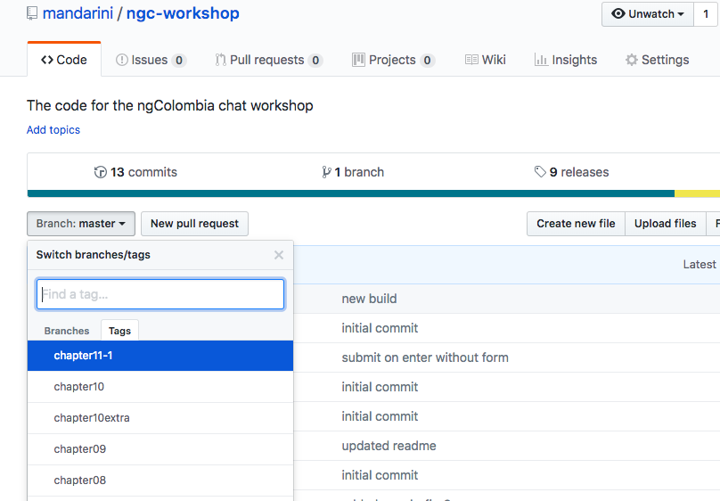

# Chapter 01 - Description of our application

[previous chapter](README.md) <----> [next chapter](Chapter_02.md) | [home](README.md)

Today we will design and develop a simple chat application using [Angular](https://angular.io/), [Firebase](https://firebase.google.com/) and the [angularfire2](https://github.com/angular/angularfire2) library.

Our final application will look something like this:


After this, each of you can proceed with adding their own styles or additional functionalities and information (eg. timestamp, different appearance of messages and usernames, etc.)

## Requirements

This is a chat application, so we will have the following requirements:

1. Different users
2. Some type of authenticating these users
3. A log-in screen
4. A log-out button
5. A place where all the messages appear
6. An input field where we can type our messages
7. Preferably, we could make it responsive, so that we can use it on our mobile phones
8. Also, a place to store all these messages
9. And a way to fetch these messages

## How to stay on the same page as everyone

Ok, so this is how it's going to work!
As we move along, chapter by chapter, you will be making changes to your code.
If you want to make sure that what you have is aligned with what you should have
(and what is taught and what everyone has), then you have two options:

### 1st option: check GitHub

At the end of each chapter:

1. Go to the [GitHub repository](https://github.com/mandarini/chat-workshop-docs) of this workshop.
2. Choose the chapter you are on from the Tags list in the branches drop down menu on the top
right, like this:

3. Browse the files and check your code! Always check that on the drop-down menu
you are on the correct tag (chapter)!

### 2nd option: Checkout the code from GitHub on each chapter-tag

At the end of each chapter:

1. Clone the [GitHub repository](https://github.com/mandarini/chat-workshop) of this workshop:
```
git clone https://github.com/mandarini/chat-workshop.git
```
2. Fetch all the tags locally:
```
git fetch --all --tags --prune
```
2. Checkout to the corresponding chapter tag for each chapter:
```
git checkout tags/tag-name
```
3. Check your code!

### Note

_We are not using the checkout option for all the workshop, because I want you to learn
to create a new Angular app, a new project, a new repository, and deploy it in the end!_


[previous chapter](README.md) <----> [next chapter](Chapter_02.md) | [home](README.md)
