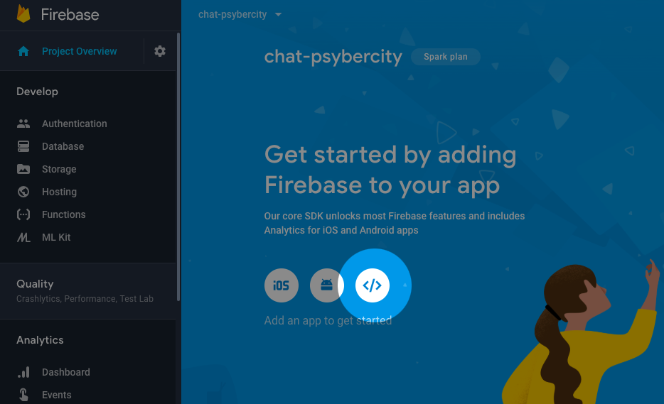
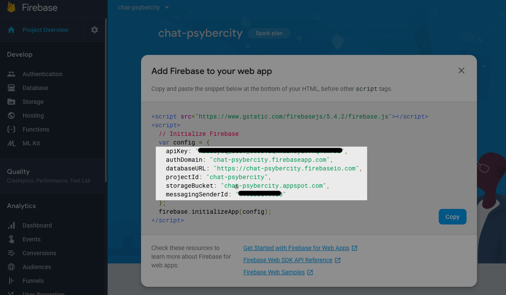

# Chapter 04 - Set up Firebase (in console and in Angular)

[previous chapter](Chapter_03.md) <----> [next chapter](Chapter_05.md) | [home](README.md)

## Creating an account on Firebase

1. Go to [firebase.google.com/](https://firebase.google.com/) and sign in with your
google account (if you don't have a google account, kindly create one).
2. Go to the Firebase [console](https://console.firebase.google.com/) and
create a new project.
3. Get familiar with the Firebase console and its parts!

## Install angularfire2

Now, let us add the [angularfire2](https://github.com/angular/angularfire2) library
to our project, the library that will help
us use Firebase functions in our Angular project.
In your terminal type:
```
npm install firebase angularfire2 --save
```

## Setting up Firebase in our Angular app

Now, we need to set up Firebase in our Angular application.

Open the file `src/app/app.module.ts`.

1. On the top of the file, copy and paste the following imports:
```
import { AngularFireModule } from 'angularfire2';
import { AngularFireDatabaseModule } from 'angularfire2/database';
import { AngularFirestoreModule } from 'angularfire2/firestore';
import { AngularFireAuthModule } from 'angularfire2/auth';
```

2. Below the imports, declare the `config` constant that contains all the configuration
code for our Firebase:

```
const config = {
    apiKey: <YOUR_API_KEY>,
    authDomain: "YOUR_PROJECT_ID.firebaseapp.com",
    databaseURL: "https://YOUR_PROJECT_ID.firebaseio.com",
    projectId: "YOUR_PROJECT_ID",
    storageBucket: "YOUR_PROJECT_ID.appspot.com",
    messagingSenderId: <YOUR_MESSAGESENDER_ID>
};
```

All this information is available in the *Project Overview* tab of your project
in the Firebase Console.
In the *Get Started* section, if you click on the web app icon, you will find the
configuration parameters of your project:



3. Within the `@NgModule`, modify the imports array like this:
```
imports: [
  BrowserModule,
  AngularFireModule.initializeApp(config),
  AngularFireDatabaseModule,
  AngularFirestoreModule,
  AngularFireAuthModule
],
```


And now you are ready to go!
Firebase is all set up!

[previous chapter](Chapter_03.md) <----> [next chapter](Chapter_05.md) | [home](README.md)
