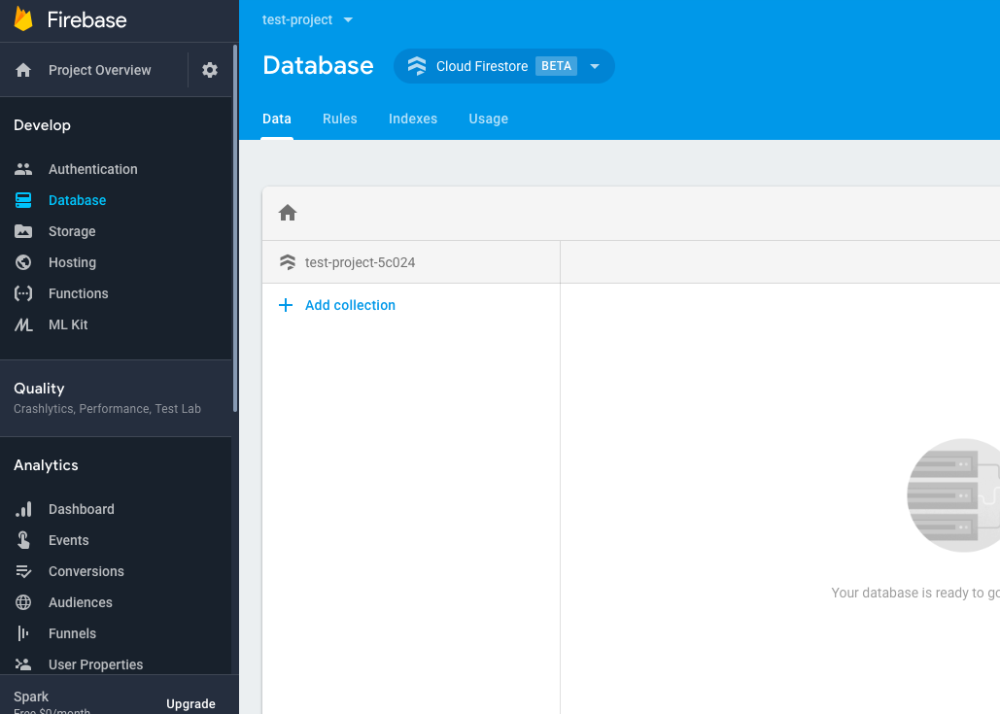
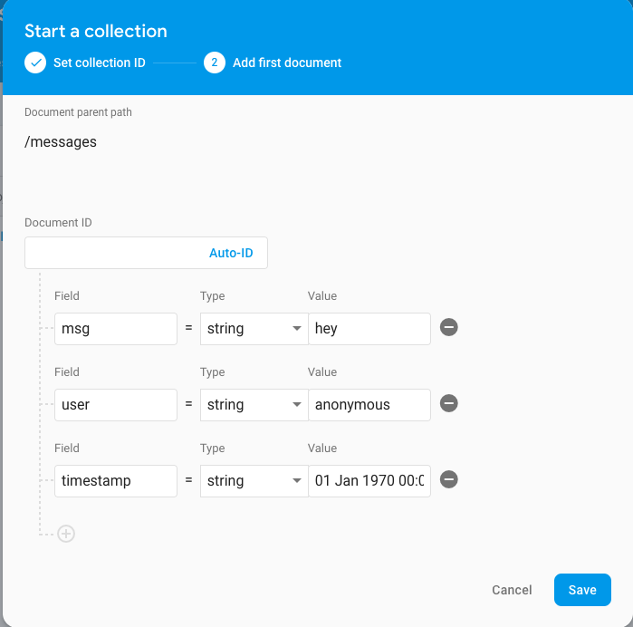

# Chapter 06 - Create our data in Firestore

[previous chapter](Chapter_05.md) <----> [next chapter](Chapter_07.md) | [home](README.md)

So, at the moment we have created an Angular application, we have set up Firebase (both within the application
  using angularfire2 and on the console) we have set up authentication on the Firebase
  console and on the application and we have created a container component called `<app-chat>` which
  will our chat application (the content for authorized users).

Now, let us go to our Firebase console again, and set up our data.
As we discussed, we will need a collection (an array) that will contain all our messages.
Each message will be an object that will contain:
* the message
* the user name
* a timestamp (date)

## Create Database

On your Firebase console, from the side menu, click __Database__ and choose _"Create Database"_ under
the __Cloud Firestore__.
Choose _"Start in test mode"_. This will allow everyone to read/write to our database. It does not matter
very much at the moment, since we will be setting read and write rules soon.

## Create Data Collection

You should now be looking a screen that looks like this:



On the __Data__ tab, click _"+ Add collection"_.
As explained in the pop-up,
_"A collection is a set of documents that contain data. Collection 'users' would contain
a unique document for each user"_

Sounds like what we need! We need a unique document for each message in our messages collection!

So, we name our collection __messages__.

Now, we can add one sample document just to add something to our collection.
Let's add a message as it would look.


Leave the ID field empty so that it takes an automatic ID, and click _Save_.

Tada! Now our collection is ready to receive and send data! It should look something like
this:


## Add read-write rules

Of course we want to secure our data and not let anyone do what they want with them.
In this workshop we will only deny access to unauthenticated users. This means that
whoever logs in will have access to read and write to our database. Rules can
become more complex, and you can find all you need in the official Firebase [documentation](https://firebase.google.com/docs/firestore/security/get-started).

At the moment, we will replace the existing rule to this:
```
allow read, write: if request.auth.uid != null;
```
which means that we allow read and write if the requested authorization uid is not null, which
means "if a user is signed in".


[previous chapter](Chapter_05.md) <----> [next chapter](Chapter_07.md) | [home](README.md)
