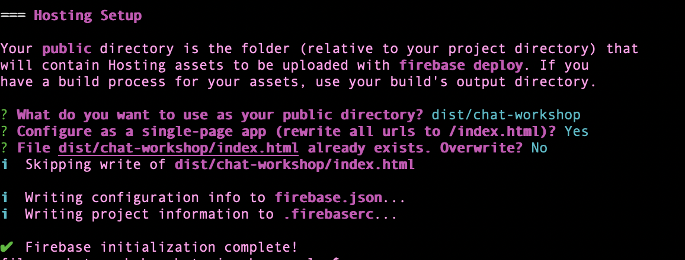
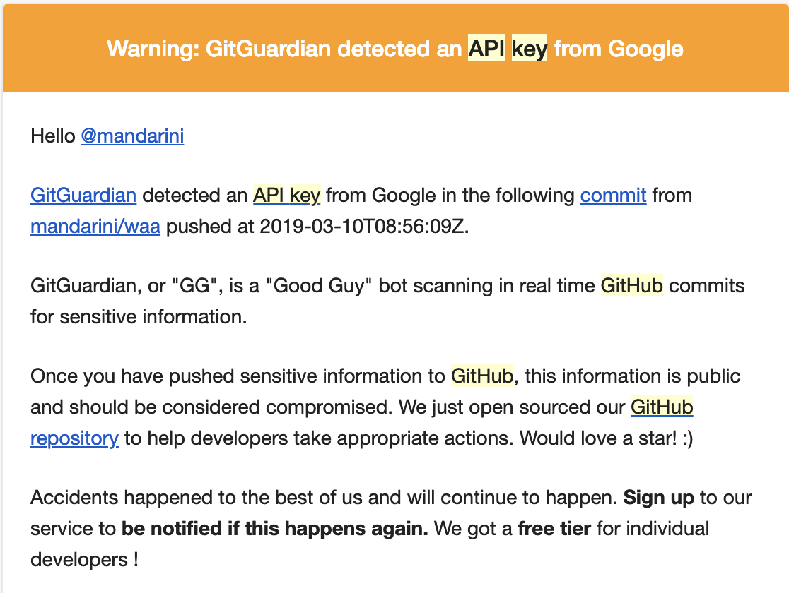

# Chapter 10 - Deploy

[previous chapter](Chapter_09.md) <----> [next chapter](Chapter_11.md) | [home](README.md)

Now that all is said and done, we are ready to deploy!

We're going to deploy our Angular application to [Firebase hosting](https://firebase.google.com/docs/hosting/).

## Optional Step - Pushing our project to GitHub

You can, if you want, push your project to GitHub. The following steps
are very explanatory, in case someone has never used git before, so bear with me here!
If you are a pro, just push your project to GitHub and move to the next step!

1. Go to your GitHub profile, and on the top right click the plus sign (__+__) button
to create a _New Repository_.
2. Name your new repository. For your own convenience, it might be better if you
give your new repository the name you already have for your project.
3. Leave all the other settings as they are and click _Create Repository_.
4. In your terminal, in your project folder, type:
```
git init
```
This command will initialize an empty git repository in your folder. We are not
going to explain how git works at the moment.

_However, you can think of a git
repository as a bucket that waits to be filled with your code. At the moment it is empty.
Each time you change your code, you have to say that you changed it (`commit` with
  an explanation message, that will act as a milestone), and then you have to add
  your new code to that bucket again.
  The bucket will take care to keep track of all these changes. I'm sure this is not
a very good explanation of git, but it will do for now._

Now, as we explained, you have to tell git that you have new code (like a milestone)
 and then add your code to your empty repository. So, in your terminal type:
```
git commit -m 'initial commit or whatever else you want'
```
and then
```
git add --all
```
to add all the code in the repository.
5. Now that all code is added in our local repository, we have to upload it (push it)
to GitHub. So, from the GitHub page of your empty new repository, copy the line
that adds a remote origin to your local repository:
```
git remote add origin https://github.com/YOURUSERNAME/YOUR-PROJECT-NAME.git
```
We will be using `https` instead of `SSH` to simplify things for you, for the moment.
This will connect your local repository to the repository on GitHub (remote).

Then, just push your local copy to GitHub, typing:
```
git push -u origin master
```
6. Refresh the page on your GitHub and see that all your code is there!

## Deploying to Firebase

In order to deploy our project easily on Firebase, we need the [firebase tools](https://www.npmjs.com/package/firebase-tools) we installed in
Chapter 02.

The gist is -> you manage your application on Firebase console through the command line.

1. So, first thing to do is sign in:
```
firebase login
```

Now, firebase tools know who you are what your projects are. Ypu can see them by running
```
firebase list
```
but that's not what we need.

2. We need to choose the project we want to and generate the files we need to for deployment.
So, in your console run
```
firebase init
```
This will eventually generate two files, `firebase.json` and `.firebaserc`. You can read more about these files in 
the [documentation](https://firebase.google.com/docs/cli/#initialize_a_firebase_project).

  * In the first step/question choose Firestore and Hosting. You don't really __have__ to choose 
  Firestore, but in this way you can version control your security rules (they are version 
  controled anyhow in the console, but you can have them right there in your project if you do so, so it's cool.)

    

  * In __Hosting Setup__:
    * in the _pubic directory_ question, be sure to specify 
       the public directory to be "`dist/you_applications_name`".
    * Configure as a single-page app --> Yes     
    * And don't overwrite `index.html`
  
  
  
3. Now that initialization is finished, take a look at your generated files! You can read more about `firebase.json` in the [docs](https://firebase.google.com/docs/cli/#the_firebasejson_file).

4. So, now we have to build our application for production!

```
ng build --prod
```

The `--prod` flag will replace the `environment.ts` file with the `environment.prod.ts`, which has the `production` flag set to `true`,
which will enable production mode (`enableProdMode()` in `main.ts`). Read more [here](https://angular.io/api/core/enableProdMode) or ask me! :)

This command will generate a directory, `dist/`, into which will be all we need for our app to run. 


5. And now, my favorite step! Just type and run

```
firebase deploy
```
And your app is live in the URL provided there!

Now. go to your [console](https://console.firebase.google.com/), in your project, at the hosting tab, and see it there!


## WAIT!

### Wait, did I just push my API keys on GitHub?

GitGuardian is probably already knocking frantically at your door. 



This can't be ok, can it?
[Well, it can](https://stackoverflow.com/questions/37482366/is-it-safe-to-expose-firebase-apikey-to-the-public). 
Your database is as safe as your security rules.

Copyingn from the accepted answer, answered by a [Firebase engineer](https://stackoverflow.com/users/209103/frank-van-puffelen), 
  "The apiKey essentially just identifies your Firebase project on the Google servers. It is not a security risk for someone to know it. In fact, it is necessary for them to know it, in order for them to interact with your Firebase project.

  In that sense it is very similar to the database URL that Firebase has historically been used to identify the back-end: https://<app-id>.firebaseio.com"

It's also very much like your Google Maps JS API key, if you're using the Google Maps JS API, that is.
So, you should rely on your security rules for security. Which guard your application against your __clients__ actions.

For any more questions on that, give me a shout out! And, watch [this great video](https://youtu.be/eW5MdE3ZcAw) that explains Firestore security and the rules complexity.

[previous chapter](Chapter_09.md) <----> [next chapter](Chapter_11.md) | [home](README.md)
